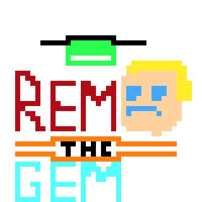
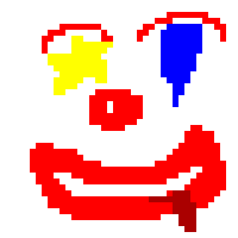
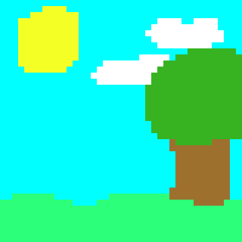

# Pixel Art Editor (Should have picked a better name)
A simple Desktop application (also under construction) built with Qt and C++ to make simple pixel art on a 40x40 grid.

## Features
- Color Picker
- Clear Canvas
- Save Drawing (PNG only for now)
- Select tool (Brush, Eraser, Eye Dropper, Fill)
- Undo/Redo
- More on the way!! (If i dont forget about this)



## Made in Pixel Art Editor

(I can't draw for the life of me lol but i hope you can!)

<p float="left">

</p>

## Coming Soon
- Undo/Redo (done)
- Save Drawing in more formats
- Reload old art
- Brush sizes
- Memory Optimization
- and more! (No promises) 


## Clone the Repository
```bash
git clone https://github.com/RemTheGem/Pixel-Art-Editor.git
```
